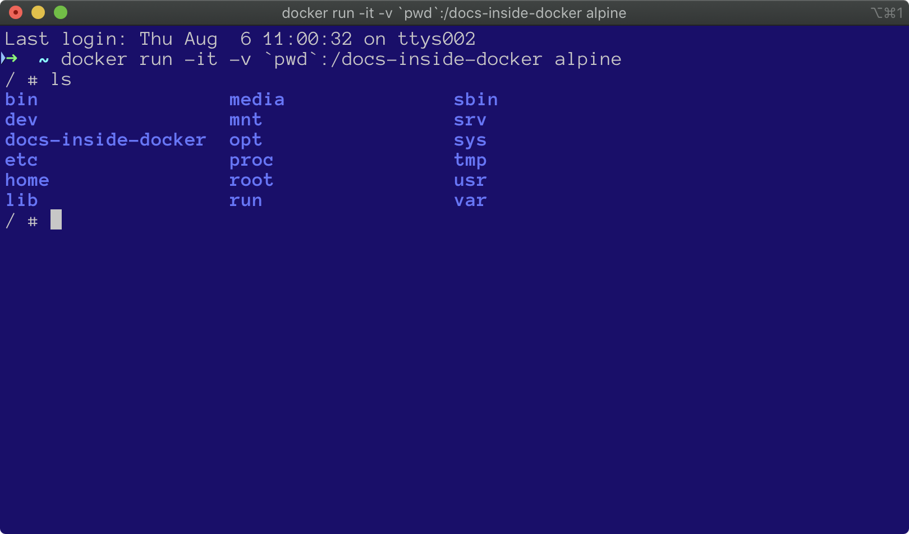

# Introduction to Docker

Docker is a computer program and online service which helps standardise the running of data processing tasks, regardless of the operating systems of all the people who might want to run those tasks. Rather than building separate systems for Windows, Linux, Mac, we can write one lot of scripts and run them on a myriad of systems.


## Requirements

- Good internet connection
- To install Docker on Windows requires Windows 10 64-bit: Pro, Enterprise, or Education ([specifics](https://docs.docker.com/docker-for-windows/install/))


## Jargon

A *terminal* is a program you need to run in order to interact with Docker. Docker itself will run on your computer and you communicate with it via simple, one-line text commands entered within your terminal application. When you use an application like Elan or Word, you are using a *graphical user interface* (GUI) to do stuff to your data via menus and buttons. Another way of doing stuff with your data is by running software scripts that don't have a GUI, via a terminal.


## Install Docker
 
Download the Docker installer. You will need to create a free account to register before downloading the installer. 
- OS X: https://docs.docker.com/docker-for-mac/install/
- Windows: https://docs.docker.com/docker-for-windows/install/
- Linux (Ubuntu): https://docs.docker.com/engine/installation/linux/ubuntu/

Run the installer. You may be prompted to authenticate the installer with your computer's password.
Once Docker is installed, start it. On a Mac, you will see a little whale icon in the top menu bar. 

For the rest of the workshop, we will be using a terminal to run commands. On Mac, use the Terminal app in your Applications > Utilities folder. For Windows, use Command Prompt.

Let's make sure that Docker has installed. Open your terminal, and type the following command at the *command line prompt* (on OSX, the prompt is `$` and Windows it is `>`). You don't need to type the `$` or `>`, the commands in this guide are prefixed with them, just type what follows. Press `Return` (or `Enter`) after typing the command.

```shell script
$ docker --version
```

In this *command*, `docker` is the name of a program, `--version` is an *option* (also known as an `argument` or `flag`). When we work with command line programs, we don't have buttons or menus to interact with the program, so we use options to control what the program does. After running that command, we should see some version information. Hooray! Now let's start working with Docker images.

A Docker *image* is not a picture of something, it is a bundle containing an operating system and programs (and sometimes data) that someone has built for a particular task. Docker images can be shared online at https://hub.docker.com. Images are unpacked as containers, in which we run programs and do stuff.


### Exercise 1: Hello World - getting familiar with Docker

Let's get a taste of  using docker images and containers by playing with a very simple one first. 

1.1 
First ensure that Docker is installed and running. 

1.2 
At your command prompt, type:
```shell script
$ docker run hello-world
```

1.3
if this is the first time you've done this, you will see this (somewhat confusing) message printed in the terminal, which means the Docker image hasn't been downloaded to your computer before. If you've done this before, jump to 1.7.
```shell script
Unable to find image 'hello-world:latest' locally
```

1.4 
The Docker program will then try to download the image:
```shell script
latest: Pulling from library/hello-world
```

1.5
Docker images are downloaded in "layers", each of which has an ID. Docker will list the layers, and the download status of each.
```shell script
0e03bdcc26d7: Pull complete
```

1.6 
This message indicates that the entire image has been downloaded and is ready for use. 
```shell script
Digest: sha256:49a1c8800c94df04e9658809b006fd8a686cab8028d33cfba2cc049724254202
Status: Downloaded newer image for hello-world:latest
 ```
1.7 
The `hello-world` container prints some text to the screen then closes itself. In Exercise 2 we will see how to keep a container open and interact with it.
 

### Exercise 2: Looking inside a Docker container

In this exercise we will create a small container and peek inside, using an interactive session.

2.1
Run this command to create a container from the `alpine` image. We include the `-it` option to specify that our interaction with the container will be interactive. This builds the container from the image and keeps the container open in the terminal for us to interact with.
```shell script
$ docker run -it alpine
```

2.2
The terminal will now show a `#` (hash) prompt, rather than the `$` or `>` symbols. When you see the hash, you know you are inside the container. When you exit the container, you will return to the normal prompt.

2.3
At the hash, type `ls`, which is a command to show a list of the files in the folder we are currently in, inside the container (by the way, that's a lowercase L and lowercase S) ...
```shell script
/ # ls
```

2.4
... which shows us the files and folders of the operating system. 
```shell script
bin    dev    etc    home   lib    media  mnt    proc   root   run    sbin   srv    sys    tmp    usr    var
```

2.5
To get out of the container, type `exit`, which will return you to the regular command prompt.
```shell script
/ # exit
```


### Exercise 3: Sharing data with a Docker container

3.1
To work with our own data in the container, we share the data folder with the container when we run it. The next command extends what we have used so far, adding a new option `-v` and the path to the local data joined to a name by which we will be able to access the folder inside the container.
> `pwd` is an alias for the (p)resent (w)orking (d)irectory. When you start your terminal, the present working directory is your home folder. You can check by typing `pwd` at the terminal - it will write the path to the current folder in the terminal.
>
> You may need to copy and paste the command as the backtick things may not be on your particular keyboard! They aren't on the German keyboard for instance. 
>
> Windows users, replace `pwd` with `%cd%` or `${PWD}` depending on your terminal. See [SO](https://stackoverflow.com/a/41489151) for more information. 
>
>Remember that you don't need to copy the `$`, just what follows it.

```shell script
$ docker run -it -v `pwd`:/docs-inside-docker alpine
```

3.2
`-v` is the name of the option that tells Docker we want to mount (kind of like sharing) a volume (essentially a folder or directory) into the container.

3.3
In the next part of the command, the information before the colon is the path to your local data (also known as the source). 
The information after the colon is where it ends up in the container (also known as the target). You can set this to any other name, and adapt the following commands accordingly. 
> Windows users, remember to [change pwd according to your system](https://stackoverflow.com/a/41489151). 


3.3
Now we can verify that the local data has been shared with the container by listing files and folders in the container.

If you type `ls` you should see a list of the files and folders that are in the current location. This should show us the files in the Alpine container, including the `docs-inside-docker` folder which our last command created.  



3.4

Type  `ls docs-inside-docker` 

This should show us the files and folders inside the `docs-inside-docker` folder. They should be the names of the files that you see in your Finder or Windows Explorer view of the input folder. Type `exit` at the command prompt to close the container. Then close the terminal window.

```shell script
/ # exit
```

